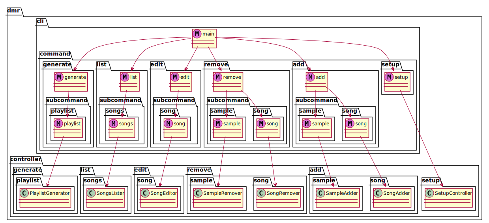

# CLI

## Technologies

* [click](http://click.pocoo.org/6/) with [click_shell](https://github.com/clarkperkins/click-shell)

## Responsibilities

* Allow users to Create, Remove, Update, Delete files in local and remote libraries.

## Overview

## Extensibility

In order to make adding mew commands easier, we aim to follow the Open-Closed principle. Thus, new functionality should be able to be added without modifying existing code. Click Command Groups, Dependency injection, and `@pass_controller` help us to abide by OCP.

### Click Command Groups

The entry point, the `dmr` command, is itself a command group. Other subcommands such as `add` and `remove` can be nested under the `dmr` command using click's `Group.add_command()` to create `dmr add` and `dmr remove`. Ideally, the names of the each of the subcommands would be obtained from a file, so that source code does not have to be modified to modify the command groups. COmmand groups can be nested recursively.

### Dependency Injection

The Dependency Inversion Principle (DIP) helps us to abide by OCP. We use the Python [dependency_injector](http://python-dependency-injector.ets-labs.org/index.html) framework to enable DIP. Each controller's module should have a container and (perhaps several) providers which specify how to wire all of the controller's dependencies. Containers can reference lower level containers and providers, but they should not reference higher level containers and providers.

### `@pass_controller`

The `utils.pass_controller` decorator is similar to the suggested `pass_obj` decorator in the click documentation. It takes in, as an argument, a controller's provider and returns a function that will invoke the provider and pass the controller into the decorated function.