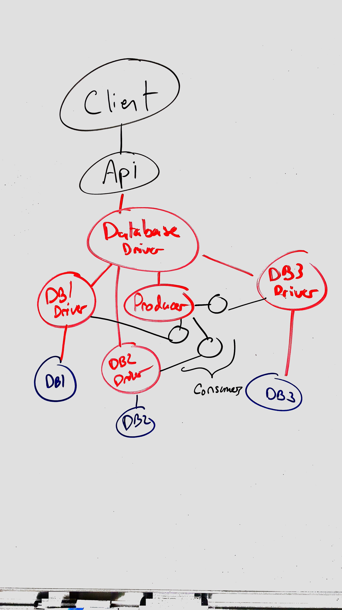

# Server

## Technologies

* [MongoDB](https://www.mongodb.com/) for metadata
* [Cassandra](http://cassandra.apache.org/) for blob storage
* Python for DB Driver
* [Solr](http://lucene.apache.org/solr/) or [Elasticsearch](https://www.elastic.co/)

## Responsibilities

* Manages the MP3 library.
* Receives new songs from clients and adds to the library.
* Removes songs from the library.
* Modifies data about the songs in the library.
* Serves the library - makes it available for download to the client.

## Database Concept

